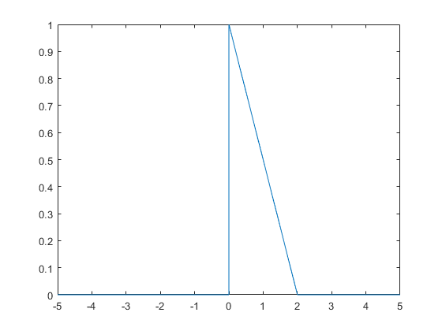
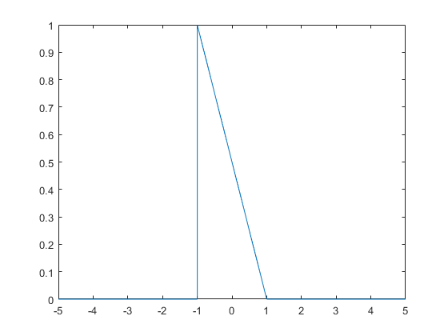

# ConvApp
Matlab Convolution Demo App

# Pulse Shapes

##  Triangular Pulse #3


```
 ftri_3 = triangularPulse(0,1,1,-0.5*(x-2));
```

##  Triangular Pulse #4


```
ftri_4 = triangularPulse(0,1,1,-0.5*(x-1));
```

