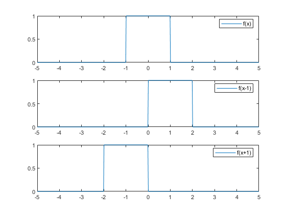

# ConvApp
Matlab Convolution Demo App.  
When looking at the code you might realize there's a similarity to the autocorrelation / cross correlation demo app. :)  


## Preface
So you're still having trouble remembering whether subtracting from the x-value shifts a function to the right or to the left? Consider the plot below:  


Subtracting shifts to the right, adding shifts to the left.  
Remembering this is important. Only with that in mind will you understand what is happing during convolution and how moving the slider moves the red signal (and why positive values of the slider move the signal to the right).

Another one to remember is how a function gets mirrored at the y-axis:


The function will be inverted if we invert the argument ("x" -> "-x").

# Pulse Shapes

## Rectangular Pulse #1

```
frect_1 = rectangularPulse(-1,1,x);
```

## Triangular Pulse #1

```
ftri_1 = triangularPulse(-1,0,1,x);
```

## Triangular Pulse #2

```
ftri_2 = triangularPulse(-2,0,0,x);
```

##  Triangular Pulse #3


```
 ftri_3 = triangularPulse(0,1,1,-0.5*(x-2));
```

##  Triangular Pulse #4


```
ftri_4 = triangularPulse(0,1,1,-0.5*(x-1));
```

